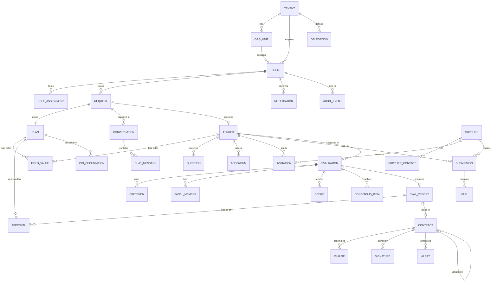
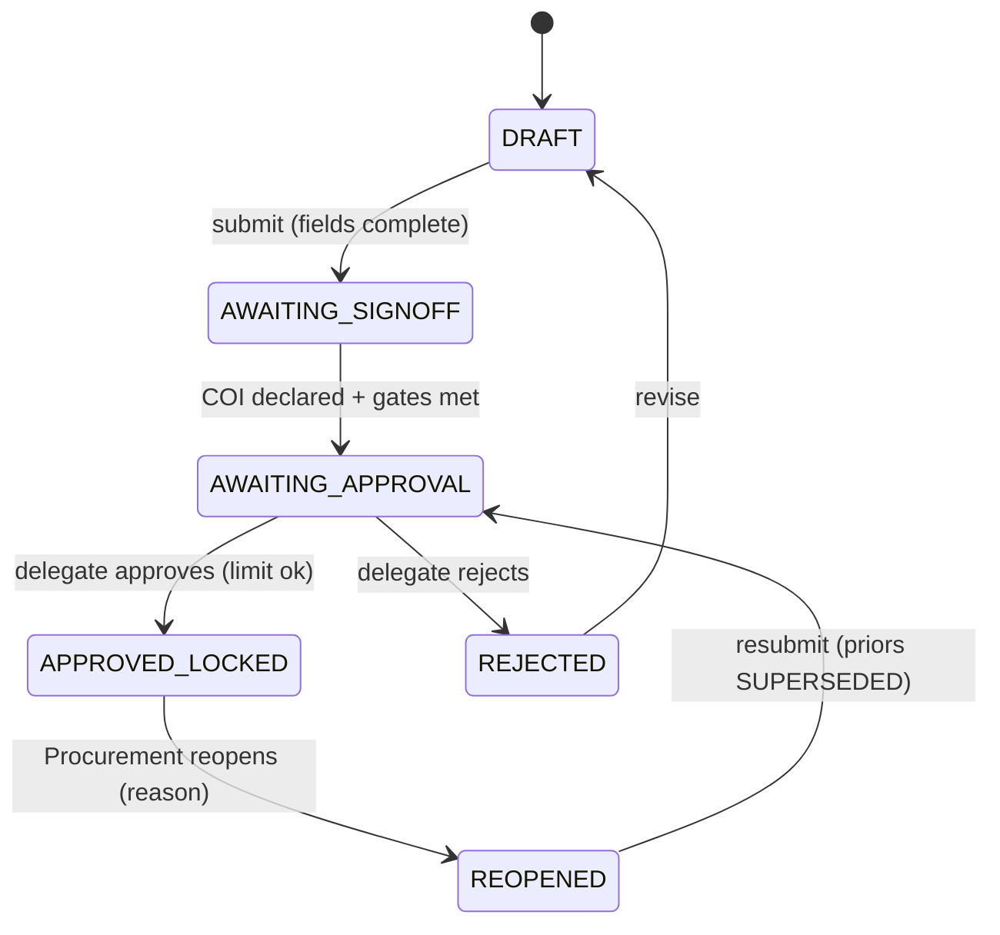
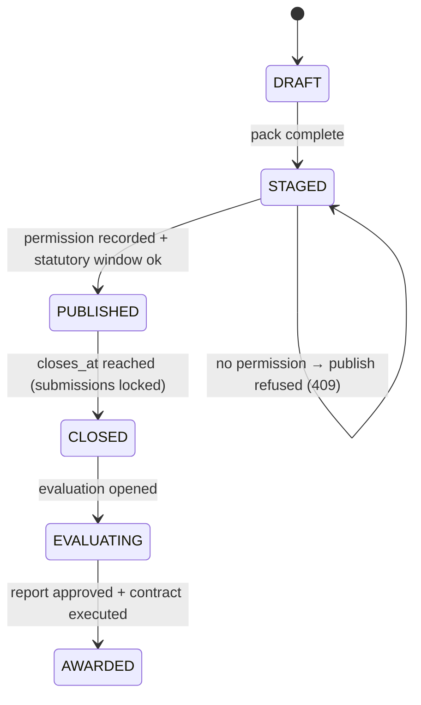

# 03 – Technical Specification

**Product:** Intuitive Fusion – Procurement Portal (POC)  |  **Phase:** 2  |  **Version:** 0.1 DRAFT  |  **Date:** 2026-10-02
**Inputs:** [01-Requirements-Document.md](01-Requirements-Document.md), [02-RTM.md](02-RTM.md)
**Companion artefacts:** [api/openapi.json](api/openapi.json) (OpenAPI 3.0.3, 69 operations) · [api/endpoint-table.md](api/endpoint-table.md)
**Status:** For approval. Drafted on the defaults in Requirements §8. No code written.

---

## 1. Scope

### 1.1 In scope (POC)
Landing → login → role-based app shell → nine modules (INT, PLN, TND, SUP, EVL, CON, CMG, RPT, ADM) + MIG/AIA stubs, mock AI, mock identity, mock integrations (ERP budget, sanctions, insurance, e-signature, email), audit, RBAC/ABAC, delegation-of-authority, seed data, theme file.

### 1.2 Out of scope (POC)
Real LLM, speech, real IdP/MFA, real integrations, native apps, IRAP evidence, DR execution, envelope encryption, 20 *Won't* FRs. Each has a named **adapter interface** (§9) so the production build replaces the mock without changing callers.

## 2. Module breakdown and feature priority (MoSCoW)

"Working" = end-to-end in Phase 5 (UI → API → DB) with automated tests. "Stub" = page + API + seed list + "Coming soon" state. Priority is MoSCoW **for the POC** (distinct from the register's product MoSCoW, which is kept in the RTM).

| Module | Working functions (POC **Must**) | Stubbed (POC **Should**) | Deferred (POC **Won't**) |
|---|---|---|---|
| **PLT** Shell | Landing, login/logout, role redirect, route guards, notifications bell, profile menu, theme + dark mode | Forgot-password email delivery (UI confirmation only), MFA prompt | Real IdP |
| **INT** Intake & AI | 1. Chat intake creates & pre-fills request (FR-0005/6, 0035) 2. Complexity score + governance gates (FR-0060) 3. My requests list/detail | Self-service vs team-led routing (0040), ERP budget check mock (0050/55), taxonomy lookup, layouts | Voice (shown as Coming soon), supplier inference |
| **PLN** Plan | 1. Auto-populated plan view (0075) 2. Instruction-based field/paragraph edit with undo (0745) 3. Delegate approve/lock on mobile + COI declare/route (0080/0105) + reopen | Date ripple, drag-and-drop layout, tagging | Co-editing presence |
| **TND** Tender pack | 1. Generate pack (0110/0120) 2. Staged → permission → publish (0150) 3. Anonymised Q&A + addendum (0135) | Statutory window validator UI, Word/PDF export, deviation register | Interactive response schedules |
| **SUP** Supplier/Tender portal | 1. Invite + self-register (0235) 2. One-tender view, access control (0155/0160) 3. Upload + submit + close-lock (0165/0170) | Sanctions/insurance status (mock), multi-stage | Dual-witness decrypt, OCR |
| **EVL** Evaluation | 1. COI gate (0300) 2. Hidden independent scoring with stream isolation (0260/0270) 3. Consensus + variance flag + lock (0275) 4. Report generate (0345) | Pass/fail gate UI, BAFO workspace, probity portal, sign-off | AI negotiation plan |
| **CON** Contract & Legal | 1. Draft from template + clauses (0395) 2. Release & sign with separate signing authority (0380/0410/0420 mock) 3. Lock after signing (0455) | Deviation register, variations, legal endorsement | Redlining, blind signing |
| **CMG** Contract mgmt | 1. Record from executed contract (0490) 2. Auto alerts incl. notice rule (0505) 3. Expiring-in-90-days + Gantt (0635/0640) | Custom alert by instruction, spend tracking, variations | 3-way match, rebate tracking |
| **RPT** Reporting | 1. Role-scoped dashboard KPIs (0590/0650) 2. Audit trail search + export (0615/0630) | Spend/maverick, workload, geospatial | Predictive analytics |
| **ADM** Admin | 1. Users & roles 2. Delegation thresholds edit (0715) 3. Workflow/template library (read) | Workflow editing, labels, numbering | Layout designer |
| **MIG** Migration | – | CSV upload + profiling report | AI extraction |
| **AIA** Cross-cutting | AI badge + human gate, audit of AI actions | Tracked changes | Concurrent editing |

## 3. Domain model

### 3.1 ER diagram (logical)



### 3.2 Entities (key attributes; all tables carry `id uuid pk`, `tenant_id`, `created_at`, `updated_at`, `version int`)

| Entity | Key attributes | Rules / constraints |
|---|---|---|
| tenant | name, region (`ap-southeast-2`), sector (`PUBLIC/PRIVATE`), config jsonb (thresholds, variance %, statutory days) | One row seeded; all rows tenant-scoped |
| user | email (unique/tenant), name, org_unit_id, password_hash (mock; argon2id), active, failed_attempts, locked_until, supplier_id? | Supplier users have `supplier_id` and role `SUPPLIER` only |
| role_assignment | user_id, role (enum 12), division? | A user may hold several roles; SoD checked on use |
| delegation | scope (`SOURCING_APPROVAL/CONTRACT_SIGNING/PUBLISH_PERMISSION`), max_value, division?, role | Signing and sourcing are separate rows (SEC-AC05) |
| request | number (`PR-2026-0001`), title, category, unspsc, est_value, term_months, business_unit, requester_id, phase, status, intake_mode, complexity, budget_check | `number` generated sequentially, format configurable |
| conversation / chat_message | purpose, context_id, role, text, proposed_changes jsonb, simulated bool | Retained & audited (SEC-L05) |
| plan | request_id (1:1), status, summary, locked bool | `locked` set on approval; update on locked → 423 |
| field_value | owner_type, owner_id, key, label, value text, source (`USER/AI/SYSTEM/MIGRATED`), ai_drafted, missing, previous_value | Unique (owner_type,owner_id,key); every change → audit before/after |
| approval | subject_type, subject_id, user_id, role, decision, comment, stamp, decided_at | Append-only; reopened plan marks priors `SUPERSEDED` |
| coi_declaration | user_id, scope (`PLAN/EVALUATION`), scope_id, none bool, nature, disposition, routed_to, decided_at | Evaluation access derived from latest declaration |
| tender | request_id, type, access (`OPEN/CLOSED`), status, opens_at, closes_at, publish_permission_id | Status machine §3.3 |
| question / addendum | tender_id, text, answer, status; addendum number, summary, issued_at | `question` has `asked_by_supplier_id` stored **only** in a restricted column excluded from every API serialiser (anonymity) |
| invitation | tender_id, email, company, token_hash, expires_at, used_at | Token single-use |
| supplier / supplier_contact | company, abn (11 digits), sanctions_status, insurance_status, last_checked_at | Bank details **not modelled** in POC (SEC-AC10 design-only) |
| submission / file | tender_id, supplier_id, status, receipt, submitted_at; file name, size, content_type, storage_key, scan_status, section | Unique active submission per supplier+tender; files stored on local disk (POC) / S3 (target); no public URL |
| evaluation / criterion / panel_member | tender_id, status; criterion weight, stream, pass_fail; panel stream, coi_state | Σ weights = 100 enforced |
| score | evaluation_id, supplier_id, criterion_id, evaluator_id, score (0–10), comment | Read path restricted to `evaluator_id = caller` until consensus opens |
| consensus_item | evaluation_id, supplier_id, criterion_id, variance_pct, flagged, consensus_score, rationale | Lock requires every flagged item to have rationale |
| eval_report | evaluation_id, status, fields, generated_at | Approval gate before contract draft |
| contract | number, tender_id, supplier_id, template_id, status, value, start/end, notice_days, parent_id, locked | `locked=true` on EXECUTED; logical delete only |
| clause / signature | contract_id, clause_id, title, text, mandatory; signature approval refs | Mandatory clauses cannot be removed |
| alert | contract_id, kind, trigger_date, recipient_rule, status, origin | Notice alert = end − notice − 60 days default (e.g. 90→150 days) |
| notification | user_id, title, body, link, read | |
| audit_event | seq bigserial, at, actor_id, actor_role, action, entity_type, entity_id, before jsonb, after jsonb, correlation_id, result, prev_hash, hash | **Append-only**: DB role has INSERT only; hash chain (`hash = sha256(prev_hash ‖ canonical row)`); verification endpoint/job |
| template / workflow | type, version, body / steps jsonb | Seeded; read-only in POC |

### 3.3 State machines


*Plan.*


*Tender.*

Evaluation: `COI_PENDING → SCORING → CONSENSUS → LOCKED → REPORTED → APPROVED`. Contract: `DRAFT → LEGAL_REVIEW → AWAITING_SIGNATURE → PARTIALLY_SIGNED → EXECUTED(locked)`.

## 4. API contracts

- Style: JSON REST under `/api/v1`, OpenAPI 3.0.3 at [api/openapi.json](api/openapi.json) (source of truth; types and client generated from it).
- Auth: HttpOnly, `SameSite=Lax`, `Secure` session cookie `if_session`; CSRF double-submit token header `X-CSRF-Token` on mutations.
- Pagination: `limit` (default 25, max 100) and `offset`; response `{items, page:{total,limit,offset}}`.
- Concurrency: `version` on editable aggregates; `expectedVersion` in body; stale → **409 `VERSION_CONFLICT`**.
- Idempotency: `Idempotency-Key` header on `submit*`, `sign`, `publish` (retry-safe; NFR-AV03).
- Correlation: every response includes `X-Correlation-Id`; echoed in errors and audit.
- Rate limits: 100 req/min/user; 10 login attempts/15 min/IP (429).
- Full operation list (69): see [api/endpoint-table.md](api/endpoint-table.md). Representative contract:

```http
POST /api/v1/assistant/conversations/{id}/messages
{ "text": "Run an RFx for facilities cleaning, three-year term, about $1.2M", "channel": "TEXT" }

201 Created
{ "id":"…", "role":"ASSISTANT",
  "text":"I've drafted the request. I still need: business unit, contract owner, delivery sites.",
  "proposedChanges":[ {"key":"title","label":"Title","value":"Facilities cleaning services","source":"AI","aiDrafted":true},
                      {"key":"estimatedValue","label":"Estimated value","value":"1200000","source":"AI","aiDrafted":true},
                      {"key":"businessUnit","label":"Business unit","source":"AI","missing":true} ] }
```

### 4.1 Error model (RFC 7807)
```json
{ "type":"https://errors.intuitivefusion.example/CONSENSUS_UNRESOLVED_FLAGS",
  "title":"Consensus cannot be locked", "status":409,
  "detail":"2 flagged items have no recorded rationale.",
  "code":"CONSENSUS_UNRESOLVED_FLAGS", "correlationId":"c1f0…",
  "errors":[{"field":"criterion:7f3…","message":"Rationale required (variance 42%)."}] }
```
Stable codes include: `VALIDATION_FAILED`, `UNAUTHENTICATED`, `FORBIDDEN`, `ROLE_SOD_VIOLATION`, `VERSION_CONFLICT`, `PLAN_LOCKED`, `PUBLISH_PERMISSION_MISSING`, `STATUTORY_WINDOW_NOT_MET`, `TENDER_CLOSED`, `COI_REQUIRED`, `CONSENSUS_UNRESOLVED_FLAGS`, `DELEGATION_EXCEEDED`, `SIGNING_AUTHORITY_INSUFFICIENT`, `CONTRACT_LOCKED`, `BUDGET_EXCEEDED`, `RATE_LIMITED`, `INTERNAL_ERROR`. Messages never leak stack traces, SQL or whether an account exists.

## 5. Authentication and authorisation

### 5.1 Authentication
- `IdentityProvider` interface: `authenticate()`, `getUser()`, `logout()`, `mfaChallenge()`. POC implementation `MockIdentityProvider` (seeded users, argon2id hashes, password policy ≥12 chars). **Swap point** documented for Cognito / Entra ID / Okta (OIDC).
- Staff and suppliers use **separate user pools** (SEC-A03) – distinct tables/cookie names in POC.
- Session: 30-min idle timeout, 8-h absolute; lockout after 5 failures (15 min); forgot-password always returns 202.
- MFA: UI step present but mocked (accepts `000000`) – flagged *simulated*; TOTP chosen as default method over SMS (open Q on SEC-A01).

### 5.2 Roles and permissions (RBAC) – ✔ allowed · (o) own records only · (a) assigned only · (s) scope by hierarchy · ✘ denied

| Capability | REQ | PROC | DELEG | EVAL | CHAIR | LEGAL | C-MGR | PROB | FIN | ADMIN | EXEC | SUPP |
|---|---|---|---|---|---|---|---|---|---|---|---|---|
| Create/edit request | ✔(o) | ✔ | ✘ | ✘ | ✘ | ✘ | ✘ | ✘ | ✘ | ✘ | ✘ | ✘ |
| View request/plan | (o) | ✔(s) | ✔(a) | (a) | (a) | (a) | (s) | ✔ ro | (s) | ✘ content | ✔(s) | ✘ |
| Edit plan (unlocked) | ✔(o) | ✔ | ✘ | ✘ | ✘ | ✘ | ✘ | ✘ | ✘ | ✘ | ✘ | ✘ |
| Approve plan / publish permission | ✘ | ✘ | ✔ within delegation | ✘ | ✘ | ✘ | ✘ | ✘ | ✘ | ✘ | ✘ | ✘ |
| Reopen locked plan | ✘ | ✔ | ✘ | ✘ | ✘ | ✘ | ✘ | ✘ | ✘ | ✘ | ✘ | ✘ |
| Create/publish tender | ✘ | ✔ | ✘ | ✘ | ✘ | edit pack | ✘ | ✘ | ✘ | ✘ | ✘ | ✘ |
| View invited tender / submit bid | ✘ | ✘ | ✘ | ✘ | ✘ | ✘ | ✘ | ✘ | ✘ | ✘ | ✘ | ✔(invited, 1 at a time) |
| View bid content | ✘ | ✔ | ✘ | stream-limited (a) | ✔ | ✔ | ✘ | ✔ ro | ✘ | **✘ never** | ✘ | own only |
| View commercial pricing | ✘ | ✔ | ✘ | **✘ if TECHNICAL stream** | ✔ | ✔ | ✘ | ✔ ro | ✘ | ✘ | ✘ | own only |
| Score (own) / see others' scores | ✘ | ✘ | ✘ | ✔ own / ✘ others | ✔ own; others only after consensus opens | ✘ | ✘ | ✔ ro after open | ✘ | ✘ | ✘ | ✘ |
| Open/lock consensus | ✘ | ✘ | ✘ | ✘ | ✔ | ✘ | ✘ | ✘ | ✘ | ✘ | ✘ | ✘ |
| Generate/approve evaluation report | ✘ | gen ✔ | approve ✔ (tier) | ✘ | ✘ | ✘ | ✘ | ✘ | ✘ | ✘ | ✘ | ✘ |
| Draft/edit contract | ✘ | draft | ✘ | ✘ | ✘ | ✔ | ✘ | ✘ | ✘ | ✘ | ✘ | ✘ |
| Sign contract | ✘ | ✘ | ✔ **signing delegation** | ✘ | ✘ | ✘ | ✘ | ✘ | ✘ | ✘ | ✘ | ✘ |
| Manage alerts / contract records | ✘ | view | ✘ | ✘ | ✘ | view | ✔ | ✘ | view | ✘ | view | ✘ |
| Audit search / export | ✘ | search | ✘ | ✘ | ✘ | ✘ | ✘ | ✔ | ✘ | ✔ | search | ✘ |
| Users / delegations / workflows | ✘ | read wf | ✘ | ✘ | ✘ | ✘ | ✘ | ✘ | ✘ | ✔ | read deleg. | ✘ |

*ABAC rules:* (1) stream isolation – evaluator sees only files whose `section` is in their stream; (2) project sensitivity attribute can restrict visibility to named users (SEC-AC02); (3) hierarchy – division heads see division, team leads see team (SEC-AC08); (4) value tier – approvals need `delegation.max_value ≥ item value` for the matching `scope` (SEC-AC04).
*Segregation of duties enforced in code:* a user holding PROCUREMENT or ADMIN on a tender cannot be an EVALUATOR on it; a signer cannot be the only sourcing approver unless a separate signing delegation exists (SEC-AC05/06, FR-0190).
*Platform ops* (`PLATFORM_OPS`) have no application path to bid content or keys (SEC-AC13, design-verified).

## 6. Audit logging
- Every state-changing call, every denial (403), login/logout/lockout, export, AI proposal and AI-applied change creates one `audit_event` in the **same DB transaction** as the change (no change without audit).
- Event: actor, role, action (`plan.approve`), entity, before/after JSON diff (field level), correlation id, result, hash chain. Sensitive values (passwords, tokens) redacted at source.
- DB privileges: application role has `INSERT, SELECT` only on `audit_event`; no `UPDATE/DELETE`; a nightly job verifies the hash chain and writes the result as an event.
- Retention: forever in POC; production period is open Q (NFR-CA03).
- Query & export: `/audit-events`, `/audit-events/export` (export is audited).

## 7. Error handling and logging
- Central error middleware maps domain errors → Problem JSON; unknown errors → 500 `INTERNAL_ERROR` with correlation id only.
- Validation with **zod** schemas generated/aligned to OpenAPI at the edge; parameterised queries only; output encoding by React; file uploads validated by magic bytes + allow-list (PDF, DOCX, PPTX, XLSX, PNG/JPG; ≤25 MB each).
- UI: error boundary per route, inline field errors, toast for transient failures, "Coming soon" component for stubs (never blank), retry with idempotency key.
- Logs: structured JSON (pino) with `correlationId`, `userId`, `route`, `latencyMs`; no PII/secret values; log level by env.

## 8. Non-functional targets and test thresholds

| Quality | Target | Measurement in POC |
|---|---|---|
| UI performance | LCP ≤ 2.5 s, TTI ≤ 3.5 s (broadband, seeded data); Lighthouse performance ≥ 80 | Lighthouse CI |
| API latency | p95 ≤ 300 ms reads, ≤ 800 ms writes at 50 concurrent users | k6 smoke (5 min) |
| Mock AI reply | ≤ 2 s p95 | Unit + k6 |
| Bid-close burst | 25 concurrent uploads of 5 MB complete, none lost | k6 scenario |
| Availability (production) | 99.9% monthly (design); RTO 4 h / RPO 1 h (proposed) | Design review only |
| Accessibility | WCAG 2.1 AA; axe 0 serious/critical; Lighthouse a11y ≥ 90 | axe-playwright, Lighthouse |
| Security | 0 critical/high in `npm audit` + SAST (Semgrep/CodeQL); OWASP ASVS L1 checklist for auth, session, access control | CI + manual |
| Test coverage | ≥ 80% line coverage on domain logic; 100% of ACs automated | Vitest coverage, AT mapping |
| Browser | Latest 2 of Chrome/Edge/Safari/Firefox; iOS Safari, Android Chrome | Playwright projects |

## 9. Integration adapters (swap points)
`IdentityProvider`, `AiProvider` (chat + draft + summarise; deterministic mock, prompt/response logged, "Simulated AI" flag), `ErpBudgetService`, `SanctionsService`, `InsuranceVerificationService`, `ESignatureProvider`, `LegalMatterService`, `DocumentStore` (local disk → S3), `EmailService` (console/outbox table → SES), `Clock` (injectable, enables alert/deadline tests). Each has a contract test suite so the mock and the production adapter are held to the same behaviour.

## 10. Test strategy
| Level | Tooling | Scope | Gate |
|---|---|---|---|
| Static | ESLint, Prettier, `tsc --noEmit`, OpenAPI lint (Redocly/Spectral) | All | Every PR |
| Unit | Vitest | Domain rules: complexity score, delegation, variance flag, notice-alert date, statutory window, SoD | ≥80% domain coverage |
| API / integration | Vitest + Supertest on ephemeral Postgres (Testcontainers or pg-mem fallback) | Contract tests vs OpenAPI, auth matrix (every role × every endpoint ⇒ expected 2xx/403), audit-in-transaction, hidden-score isolation | All endpoints |
| Component | React Testing Library | Forms, guards, Coming-soon, theme | Key components |
| E2E | Playwright | One happy path per module + negative path for each W-tier story (e.g. late bid, locked plan) | Smoke on PR, full nightly |
| Accessibility | axe-playwright, Lighthouse | All routes at 3 breakpoints, both themes | 0 serious/critical |
| Visual regression | Playwright snapshots | Landing, login, dashboard, 3 breakpoints × 2 themes | Reviewed diffs |
| Performance | k6 | Smoke + bid-close burst | Targets §8 |
| Security | `npm audit`, Semgrep, ZAP baseline scan, auth abuse tests (lockout, enumeration, IDOR matrix) | Hardening phase | 0 crit/high |
| UAT | Scripted from G/W/T (`AT-*`) | Whole POC | Sponsor sign-off |

**Traceability:** each AC → `AT-<story>-<n>` automated test → RTM result column (generated by CI from test report). Risky items and proposed spikes (not yet done): (a) hidden-score isolation at SQL view level (RLS vs service-layer) ; (b) audit hash-chain write throughput; (c) Word/PDF export fidelity; (d) Next.js + separate API vs full-stack route handlers for auth cookie handling — settled in ADRs.

## 11. Branding and design tokens (single theme file `theme.ts` → CSS variables)

### 11.1 Logo analysis
`Logo.jpg` (400×400): rounded-square slate tile (≈ `#7D8298`) holding a dark vertical bar "I" (≈ `#3D4351`→`#282E3A`) and a silver "F" (≈ `#C8CEDA`→`#A9AFBD`) with soft drop shadows. The mark is **monochrome blue-grey**; it contains no saturated hue, so an accent is *proposed* (assumption A6).

### 11.2 Palette (light) – contrast calculated by script (`_work/contrast.py`, WCAG 2.1 relative luminance)

| Role | Token | Hex | Use |
|---|---|---|---|
| Primary | `--color-primary` | `#2A303C` | Header, primary buttons, headings (from logo dark bar) |
| Primary hover | `--color-primary-600` | `#3D4351` | Logo bar mid-tone |
| Secondary | `--color-secondary` | `#717888` | Icons, borders, large text only (logo tile tone) |
| Silver | `--color-silver` | `#CED2DF` | Surfaces, dividers, chips (logo F) |
| Accent *(proposed)* | `--color-accent` | `#4254C5` | Links, focus ring, selected state, key CTA on landing |
| Text | `--color-text` | `#1B1F27` | Body |
| Muted text | `--color-text-muted` | `#5A6172` | Secondary text |
| Page / surface | `--color-bg` / `--color-surface` | `#F6F7FA` / `#FFFFFF` | |
| Success / Warning / Error / Info | `--color-success` `…-warning` `…-error` `…-info` | `#1B7A4B` / `#9A5200` / `#B42318` / `#1A5FA8` | Each with tint background `#E6F4EC` / `#FDF0DC` / `#FCE8E6` / `#E5F0FB` |
| Dark mode | `--color-bg` / surface / text / muted / accent | `#14171E` / `#1D212B` / `#E8EAF0` / `#A4ABB9` / `#8C9BFF` | semantic: `#4CC38A` `#F5B04C` `#FF8A80` `#6CB4FF` |

**WCAG AA verification (computed, 26 pairs, 0 failures):**

| Pair | Ratio | Result |
|---|---|---|
| `#2A303C` on white / white on `#2A303C` | 13.24:1 | Pass AA |
| Body `#1B1F27` on `#F6F7FA` | 15.41:1 | Pass AA |
| Muted `#5A6172` on white / on `#F6F7FA` | 6.20 / 5.79:1 | Pass AA |
| Accent `#4254C5` on white / white on accent | 6.35:1 | Pass AA |
| Success `#1B7A4B` / Warning `#9A5200` / Error `#B42318` / Info `#1A5FA8` on white | 5.34 / 5.86 / 6.57 / 6.47:1 | Pass AA |
| Same four on their tints | 4.71 / 5.21 / 5.58 / 5.60:1 | Pass AA |
| Secondary `#717888` on white | 4.43:1 | **Below 4.5 – restricted to non-text/large text (≥3:1 ok)** |
| Dark: text / muted / accent on `#14171E` | 14.91 / 7.77 / 7.04:1 | Pass AA |
| Dark: success / warning / error / info on `#14171E` | 8.10 / 9.56 / 7.86 / 8.21:1 | Pass AA |
| Focus ring accent vs page | 5.93:1 | Pass (≥3:1 UI) |

### 11.3 Other tokens
- **Typography:** headings *Plus Jakarta Sans* (600/700), UI/body *Inter* (400/500/600), mono *JetBrains Mono* for IDs; self-hosted (no third-party CDN calls). Scale: 12/14/16/18/20/24/30/36/48 px, line-height 1.5 body, 1.2 headings; fluid `clamp()` for hero.
- **Spacing:** 4-px base: 4, 8, 12, 16, 24, 32, 48, 64, 96. **Radius:** 6 (controls), 10 (cards), 16 (hero/media), 999 (pills) – echoing the logo's rounded square. **Shadows:** `sm 0 1px 2px rgba(20,23,30,.08)`, `md 0 4px 12px rgba(20,23,30,.10)`, `lg 0 12px 32px rgba(20,23,30,.14)` (soft, as in the logo).
- **Iconography:** Lucide (1.5-px stroke, 20/24 px), always with accessible names. **Motion:** 150–250 ms ease-out; all animation disabled under `prefers-reduced-motion`.
- **Breakpoints:** 640 / 768 / 1024 / 1280. Min touch target 44 px.
- **Single-file rebrand:** `packages/ui/src/theme.ts` exports the token object; build step emits `theme.css` variables for both modes; Tailwind config reads only that file.

## 12. Seed / mock data plan
Tenant is a fictitious "Meridian Group (demo)" (no real organisation implied). 12 users (one per role), 3 org units; 6 requests across phases (facilities cleaning $1.2M 3-yr; IT managed service $4.8M; office paper low-value self-service; etc.); 1 published tender with 4 suppliers and submissions; 1 evaluation at consensus with a 38% variance flag; 2 executed contracts with notice periods (one ending in 74 days); 40 audit events; 6 notifications. All clearly marked *synthetic*.

## 13. Phase 2 test results (what was run)

| # | Test | Method | Expected | Actual | Result |
|---|---|---|---|---|---|
| T2.1 | OpenAPI structural lint | `_work/lint_openapi.py` (custom: refs resolve, unique operationIds, path params declared, 2xx present, roles valid, required⊂properties) | 0 errors | 69 ops, 69 unique IDs, 62 schemas, 8 shared error responses, **0 errors** | Pass |
| T2.2 | Spec-to-RTM gap check | Every W-tier FR maps to a module in §2 and ≥1 endpoint | No gaps | Every module containing W-tier FRs has operations in the OpenAPI (checked by inspection at module/tag level, not per-FR) | Pass (module level) |
| T2.3 | Role coverage | Every endpoint's `x-roles` ⊆ defined roles | Yes | Verified in T2.1 | Pass |
| T2.4 | Contrast calculations | Script, 26 pairs | AA | 26/26 pass (one colour deliberately restricted) | Pass |
| T2.5 | Real OpenAPI linter (Redocly/Spectral) | – | – | **Not run** (needs package download; scheduled as Phase 5 CI step) | Pending |
| T2.6 | Proof-of-concept of risky items | – | – | **Not run** (spikes listed in §10; belong to Phase 4 M0) | Pending |
| T2.7 | Spec walkthrough with stakeholders | – | – | **Not performed** | Pending your review |

*Gap analysis:* Requirements without an endpoint at this level: voice intake (FR-0006 voice half), sanctions/insurance providers (covered by mock adapters), layout designer, 3-way match. All are S/D tier. **No W-tier gaps found.**

## 14. Assumptions and risks (this phase)
- API shape assumes a single Node API fronted by Next.js (ADR in Phase 3 may choose Next route handlers instead; contract unchanged).
- RLS vs service-layer for score isolation unresolved – both satisfy the contract; test matrix covers either.
- Word export for documents is "S" tier; PDF via headless print in Phase 5b.
- Large-bid uploads (50+ MB) would need pre-signed multipart upload in production; POC caps at 25 MB.

## 15. What I need from you
Approve this specification (or amend §2 tiers, §5 role matrix, §11 palette/fonts) — then I will treat Phases 3 and 4 as already drafted for joint review before any build.
