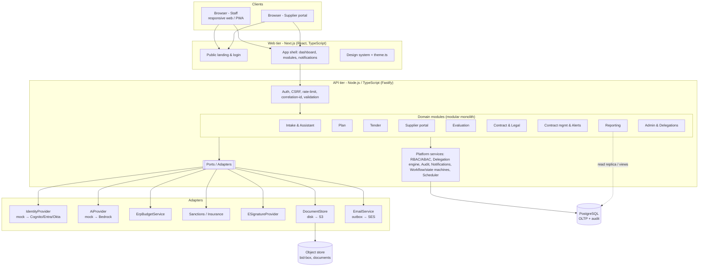
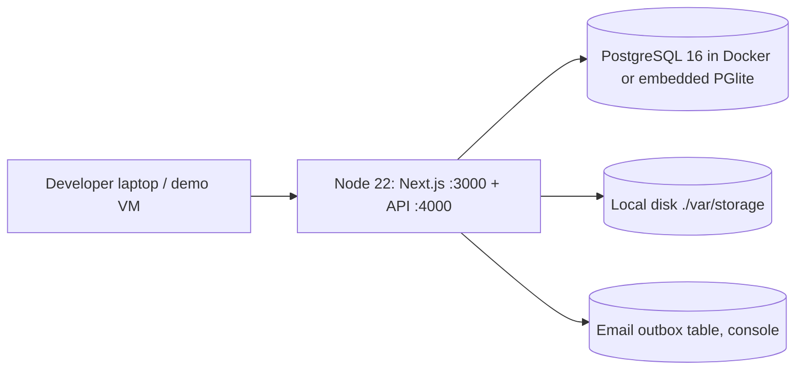
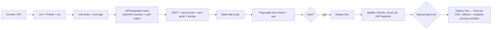

# 04 – Architecture Document

**Product:** Intuitive Fusion – Procurement Portal (POC → production path)  |  **Phase:** 3  |  **Version:** 0.1 DRAFT  |  **Date:** 2026-10-02
**Inputs:** [01-Requirements-Document.md](01-Requirements-Document.md) · [03-Technical-Specification.md](03-Technical-Specification.md) · register BRS §5 AWS proposal (indicative)
**Status:** For approval. Diagrams are Mermaid (render in GitHub/VS Code/Claude). No code written.

---

## 1. Summary
Two architectures are described and kept deliberately aligned:
- **POC architecture (built in Phase 5):** a modular monolith — Next.js web app + Node/TypeScript API + PostgreSQL — runnable on a laptop with Docker or `npm`, with every external dependency behind an adapter (mock now, AWS-native later).
- **Target architecture (design only):** the same modules deployed on AWS `ap-southeast-2` (Sydney), single-tenant-per-VPC-ready, with Cognito/IAM Identity, S3 sealed bid-box, Bedrock via VPC endpoint, and the controls in the register (SEC-D/N/L).

The POC therefore proves **behaviour and governance rules**; the target design addresses **non-functional and compliance** requirements by review (these are the 'D' tier items in the RTM).

## 2. Architecture drivers (from the requirements)
| Driver | Source | Architectural response |
|---|---|---|
| Probity: hidden scoring, stream isolation, COI before access | FR-0260/0270/0300, SEC-AC06/07 | Authorisation in the domain layer + DB views; serialisers per role; no shared "get bid" path |
| Auditability: immutable field-level trail | SEC-L01…L05 | Audit written in same transaction; append-only table; hash chain; export |
| AI governance, data sovereignty, pluggable models | NFR-C01, NFR-R01, SEC-D05, NFR-M06 | `AiProvider` port; Bedrock in-region via PrivateLink (target); prompt/response logged; human gate |
| Mobile-first approvals | Technical tab, NFR-U01 | Responsive PWA-capable web app; approval screens designed at 375 px first |
| Integrations may fail | NFR-AV03/AV04 | Ports/adapters, outbox + idempotent retry, manual fallback UI |
| Configuration without code | NFR-M05, FR-0680… | Tenant config tables (workflows, delegations, thresholds) |
| 99.9% / DR / data residency | NFR-AV01, DR01-03, R02 | Multi-AZ managed services, backups, AU-only regions |
| Rebrand in one file | Brief | Token-based theme package |

## 3. Logical architecture



**Modular-monolith rules:** modules communicate via in-process interfaces and domain events (outbox table); no module reads another's tables directly; each exposes a typed service. This keeps extraction to services possible (register BRS proposes Lambda/microservices) without paying distributed-system cost in the POC (see ADR-001).

### 3.1 Key runtime flows

**Intake → plan (sequence)**
```mermaid
sequenceDiagram
  actor U as Requester
  participant UI as Web
  participant API as API
  participant AI as AiProvider(mock)
  participant DB as PostgreSQL
  U->>UI: "Run an RFx for facilities cleaning, 3 years"
  UI->>API: POST /assistant/conversations/{id}/messages
  API->>AI: draftRequest(text, taxonomy, policy)
  AI-->>API: fields + missing[] (simulated=true)
  API->>DB: tx{ upsert request/fields; audit(ai.propose) }
  API-->>UI: reply + proposedChanges
  U->>UI: confirm / edit fields
  UI->>API: POST /requests/{id}/submit
  API->>DB: tx{ budget check, complexity score, gates, audit }
  API-->>UI: request SUBMITTED (+ gates list)
```

**Hidden scoring → consensus**
```mermaid
sequenceDiagram
  actor E as Evaluator
  actor C as Chair
  participant API
  participant DB
  E->>API: POST /evaluations/{id}/coi
  API->>DB: record declaration; grant/revoke access (audit)
  E->>API: PUT /scores (own)
  API->>DB: insert scores (evaluator_id = caller)
  E->>API: GET /scores/mine
  API->>DB: SELECT … WHERE evaluator_id = caller  (no other path)
  C->>API: POST /consensus/open
  API->>DB: compute variance, set flagged
  C->>API: POST /consensus/lock
  API-->>C: 409 if flagged without rationale
```

## 4. Deployment architecture

### 4.1 POC (local / demo)

No internet dependency at runtime; self-hosted fonts; synthetic seed data.

### 4.2 Target (AWS, `ap-southeast-2`; design only)
```mermaid
flowchart TB
  U[Users] --> R53[Route 53] --> CF[CloudFront + AWS WAF + Shield]
  subgraph VPC["VPC (3 AZ)"]
    subgraph Public
      ALB[Application Load Balancer]
    end
    subgraph Private_App["Private app subnets"]
      WEB[ECS Fargate: web]
      API[ECS Fargate: api]
      WRK[ECS Fargate: worker (alerts, outbox, doc gen)]
    end
    subgraph Private_Data["Isolated data subnets"]
      RDS[(Aurora PostgreSQL Multi-AZ<br/>KMS CMK)]
      OS[(OpenSearch / Athena<br/>analytics - optional)]
    end
    VPCE[VPC endpoints: S3, Bedrock, KMS, Secrets Manager, SES, CloudWatch]
  end
  CF --> ALB --> WEB & API
  API --> RDS
  WRK --> RDS
  API --> VPCE
  VPCE --> S3[(S3 bid-box & docs<br/>SSE-KMS, versioning, Object Lock)]
  VPCE --> BR[Amazon Bedrock<br/>in-region model]
  API --> COG[Cognito user pools:<br/>staff (federated SAML/OIDC) & suppliers]
  API --> SM[Secrets Manager]
  API --> EB[EventBridge Scheduler / SQS]
  subgraph Security_Obs["Security & observability"]
    CT[CloudTrail (org, immutable)] --- GD[GuardDuty] --- CFG[AWS Config] --- SH[Security Hub]
    CW[CloudWatch + X-Ray/OTel]
  end
```
Notes: Fargate chosen over per-function Lambda for the monolith (ADR-001/003); the BRS' Lambda/API Gateway proposal remains a valid evolution path for isolated workloads (document generation, scoring bursts). IaC via AWS CDK (TypeScript) (NFR-M01). All service choices are **indicative** per register BRS §5 and need confirmation by the client's cloud team.

## 5. Technology choices (with justification and trade-offs)

| Layer | Choice | Why | Trade-off / alternative |
|---|---|---|---|
| Language | TypeScript everywhere | One language, shared types generated from OpenAPI, strong typing for rules-heavy domain | Less mature numeric/data libs vs Python |
| Web | Next.js (App Router) + React 18 | SSR for public landing (SEO, fast LCP), file-based routing, middleware route guards | Heavier than Vite SPA; mitigated by static landing |
| UI kit | Tailwind CSS + Radix UI primitives (shadcn-style, copied in) + Lucide | Accessible primitives (focus, ARIA), tokens via CSS variables → single-file theme | Build-your-own components vs MUI (faster but harder to rebrand) |
| API | Fastify + zod + OpenAPI generation | Fast, schema-first validation, low overhead | Nest.js gives more structure but more ceremony |
| DB | PostgreSQL 16 (Aurora PG in target) | Relational integrity for probity data, JSONB for flexible fields, row-level security option, extensions | Document DB would simplify fields but weakens constraints |
| ORM/migrations | Drizzle ORM + SQL migrations (or Prisma) | Type-safe SQL close to the metal; explicit migrations | Prisma has better tooling, less SQL control |
| Auth (POC) | Mock IdP + signed session cookie (argon2id) | Satisfies "mock auth with swap point" | Not for production — replaced by Cognito/Entra OIDC |
| AI (POC) | Deterministic rule-based `MockAiProvider`; later Bedrock | Repeatable tests; no data egress | Real model adds variance/cost (ADR-005) |
| Jobs | In-process scheduler + `outbox` table (POC); EventBridge + SQS + worker (target) | Alerts, email, reminders reliably | Extra moving parts in target |
| Docs generation | Server-side HTML→PDF (Playwright/Chromium); `docx` library for Word | Uses same templates as on-screen view | Fidelity effort |
| Testing | Vitest, Supertest, Playwright, axe-playwright, k6 | Matches the brief's tools | – |
| CI/CD | GitHub Actions (POC) → same + CDK deploy via OIDC role (target) | Repo is on GitHub | CodePipeline is native-AWS alternative |
| IaC | AWS CDK (TS) | Same language; NFR-M01 | Terraform if client standard |
| Observability | pino JSON logs + OpenTelemetry; CloudWatch/X-Ray (target) | NFR-M03/M04 | – |

## 6. Security architecture

### 6.1 Principles
Zero trust between tiers; least privilege; deny by default; tenant isolation in every query; AI is advisory and logged; no secrets in code (env vars locally via `.env` not committed; Secrets Manager in AWS); defence in depth.

### 6.2 Controls by layer
| Layer | Controls (POC ✔ implemented / T target-design) |
|---|---|
| Edge | T: CloudFront + WAF managed rules + rate rules, Shield Standard/Advanced; TLS 1.2+/HSTS ✔(headers) |
| Web | ✔ CSP (nonce), `X-Content-Type-Options`, frame-ancestors none, Referrer-Policy, no inline secrets; React output encoding |
| API | ✔ zod validation, parameterised SQL, CSRF token, rate limits, secure cookies, problem+json without internals, upload allow-list + size cap; T: malware scan (GuardDuty Malware Protection / ClamAV) |
| Identity | ✔ mock IdP behind port, lockout, session timeout; T: Cognito user pools (staff federated; suppliers separate), MFA TOTP, SSO SAML/OIDC, time-bound grants |
| Authorisation | ✔ RBAC + ABAC + delegation engine + SoD (domain layer, tested via role×endpoint matrix) |
| Data | ✔ field-level audit; T: Aurora/S3 encryption with KMS CMKs (customer-managed option), per-tenant envelope key for bid-box, S3 block public access, Object Lock for executed contracts (logical delete only), backups encrypted |
| AI | ✔ mock; T: Bedrock via VPC endpoint only, no public endpoints, guardrails, prompt-injection filters on supplier-supplied text, output never auto-committed |
| Ops | T: CloudTrail (immutable, log-archive account), GuardDuty, Config rules with remediation, Security Hub, IAM Access Analyzer; break-glass role with approval + alert (SEC-AC13) |
| Supply chain | ✔ lockfile, `npm audit`, Dependabot, SAST (Semgrep/CodeQL), secret scanning (gitleaks) in CI; SBOM |

### 6.3 Threat model (STRIDE, abbreviated)
| Component / flow | S | T | R | I | D | E | Key mitigations |
|---|---|---|---|---|---|---|---|
| Login | credential stuffing | – | repudiation of actions | enumeration via messages | brute-force lock-out DoS | – | rate limit, uniform responses, argon2id, lockout with backoff, audit |
| Session cookie | theft/replay | CSRF tamper | – | XSS exfil | – | – | HttpOnly, SameSite, CSRF token, CSP, short idle timeout |
| Bid upload | fake supplier identity | file tamper after close | supplier denies submission | bid leakage to staff | flood at close | malware→code exec | per-tender invite tokens, receipt + hash, sealed storage, no pre-close read path, rate limits/autoscale, scan + allow-list |
| Scoring API | evaluator impersonation | score edit after consensus | evaluator denies score | **score/price leakage (key probity risk)** | – | tech evaluator reads price | server-side `evaluator_id=caller`, stream-scoped serialisers, tests per role, audit of reads |
| Approval / signing | forged approval | altered after approval | "I never approved" | – | – | delegate exceeds limit | stamps with timestamp, immutable approval rows, delegation check, separate signing authority, reauth for sign |
| Audit log | log forgery | log edit/delete | – | PII in logs | log flood | admin edits | append-only grants, hash chain, off-box shipping (T), redaction |
| AI assistant | prompt injection via supplier text | model output alters fields silently | – | cross-tenant context leak | token exhaustion | AI actions beyond role | proposals only, human gate, role-scoped context, size limits, logging |
| Admin console | admin impersonation | silent threshold change | – | admin reads bids | – | admin→bid access | ADMIN has no bid permission, config changes audited and dual-control (T) |

### 6.4 Environments
| Env | Purpose | Data | Deploy | Access |
|---|---|---|---|---|
| Local | Dev & demo | Synthetic seed | `npm run dev` / Docker | Developer |
| CI | Ephemeral test | Seed + generated | per PR (containers) | CI only |
| Dev (AWS) | Integration | Synthetic | auto on merge to `main` | Team |
| Test/UAT (AWS) | UAT, perf, security scans | Synthetic, scrubbed | manual promote | Team + client UAT |
| Prod (AWS) | Live | Customer | gated release with approval | Least-privilege, break-glass |
Production data never copied to lower environments (SEC-AP06). Separate AWS accounts per env (target).

## 7. CI/CD


Pipeline-as-code in `.github/workflows`; required checks protect `main`; releases tagged semver; DB migrations forward-only with rollback script, run before app start; blue/green (target).

## 8. Observability
- **Logs:** structured JSON, correlation id, no PII/secrets; shipped to CloudWatch (target).
- **Metrics:** RED per route, DB pool, outbox lag, alert-job lag, AI latency/error/cost, auth failures, 403 rate.
- **Traces:** OpenTelemetry across web → API → DB/adapters.
- **Dashboards & alarms:** availability, p95, error budget (99.9% = 43.8 min/month), failed jobs, audit-chain verification failure (page).
- **Audit ≠ logs:** the business audit trail is queryable product data (module RPT), not operational logging.

## 9. Resilience and failure-mode review

| Failure | Impact | Detection | Mitigation / behaviour |
|---|---|---|---|
| DB primary AZ failure (target) | Writes pause | RDS events, health checks | Aurora Multi-AZ failover (~60 s), app retries with idempotency keys |
| API task crash | Requests fail | ALB health | Fargate replaces; min 2 tasks |
| ERP/legal/sanctions outage | Check cannot complete | Adapter circuit breaker | Outbox retry w/ backoff; UI shows "pending, manual override with justification" (audited) (NFR-AV04) |
| AI provider outage/slow | No suggestions | Timeout 10 s | Fields remain manually editable; banner; no loss of data (NFR-U08) |
| Bid-close traffic spike | Upload failures | p95/5xx alarms | Autoscale; direct-to-S3 pre-signed uploads (target); deadline evaluated server-side on receipt |
| Clock skew near close | Disputed late bids | – | Server time authority (NTP); `Clock` port; receipt contains server timestamp |
| Poison message in outbox | Alert not sent | DLQ depth alarm | DLQ + replay tool |
| Audit write failure | Action must not succeed | Transaction rolls back | Fail closed |
| Region loss | Outage | – | Cross-AZ in region; backups/PITR; **cross-region DR not adopted** because residency is AU — second AU region (Melbourne) is an option (ADR-009, open) |
| Mis-config exposes bucket | Data leak | Config rule | Block Public Access org-wide + auto-remediation |

Proposed (to confirm): RTO 4 h, RPO 1 h; quarterly restore test, annual DR exercise.

## 10. Cost considerations
Order-of-magnitude only; **not validated against current AWS pricing** and excludes licences, Bedrock token usage at scale, support and staff time. Treat as planning ranges to be replaced by a Pricing Calculator estimate in Phase 4/hardening.

| Item | POC (local) | Target prod (small, single tenant, AU) | Main cost drivers / levers |
|---|---|---|---|
| Compute (Fargate web+api+worker, 2 AZ) | $0 | ~ USD 300–600/mo | Task size; Savings Plans; schedule non-prod off-hours |
| Database (Aurora PG Multi-AZ) | $0 | ~ USD 400–900/mo | Instance class; Serverless v2 for non-prod |
| S3 + KMS | $0 | ~ USD 20–100/mo | Documents volume; lifecycle to IA |
| WAF/CloudFront/Shield Std | $0 | ~ USD 50–150/mo | Request volume |
| Observability & security services | $0 | ~ USD 150–400/mo | Log volume, GuardDuty, Config rule count |
| Bedrock | $0 (mock) | **Usage-based**, scales with documents generated | Model choice, caching, batch for late-stage docs (NFR-P02) |
| Non-prod envs (dev/test) | – | ~ 40–60% of prod if always-on | Auto-stop, smaller sizes |
The register already notes batching later-stage AI work to manage cost (NFR-P02).

## 11. Architecture Decision Records

| ADR | Decision | Status |
|---|---|---|
| ADR-001 | **Modular monolith** (not microservices/Lambda-per-endpoint) for POC; module boundaries enforce extraction | Proposed |
| ADR-002 | **TypeScript full-stack**: Next.js web + Fastify API in an npm-workspaces monorepo | Proposed |
| ADR-003 | **PostgreSQL** (Aurora in target); JSONB for configurable fields; embedded PGlite/Docker for local | Proposed |
| ADR-004 | **Ports & adapters** for every external dependency; contract tests shared by mock and real adapter | Proposed |
| ADR-005 | **Mock AI** deterministic provider in POC; Bedrock in-region via VPC endpoint in target; human gate always | Proposed |
| ADR-006 | **Audit in-transaction, append-only with hash chain**; business audit separate from ops logs | Proposed |
| ADR-007 | **Authorisation in domain layer** (RBAC+ABAC+delegation+SoD) with role×endpoint test matrix; DB RLS considered for scores (spike) | Proposed |
| ADR-008 | **Single theme file → CSS variables**, Tailwind reads tokens only; Radix primitives for accessibility | Proposed |
| ADR-009 | **Data residency AU-only**; DR within `ap-southeast-2` multi-AZ; second AU region optional | Open (needs client) |
| ADR-010 | **Session cookies + CSRF** (BFF-style) rather than tokens in browser storage | Proposed |
| ADR-011 | **Schema-first API**: OpenAPI is the contract; types/client generated; CI breaks on drift | Proposed |
| ADR-012 | **Fargate over Lambda** for the monolith; Lambda reserved for burst/doc-generation workers | Proposed (target) |

Each ADR will be captured as `docs/adr/NNNN-title.md` (context, decision, consequences) when approved; the table above is the decision summary under review.

## 12. Compliance mapping (indicative — to be confirmed by the client's security team)
| Framework | How architecture addresses | Gap/Note |
|---|---|---|
| ACSC Essential Eight | MFA, patching via pipeline, app control by containers, backups, restricted admin | Maturity target not stated |
| ISO/IEC 27001:2022 Annex A | Register maps controls (A.8.x etc.) per SEC row | Statement of Applicability out of scope |
| Privacy Act / APPs | Data minimisation, AU residency, access logging, breach process | Notifiable-breach process TBD |
| IRAP / ISM | Reliance on IRAP-assessed AWS services; platform assessment scope TBC | Open question |
| WCAG 2.1 AA | Tokens + Radix + axe in CI | Manual screen-reader pass in hardening |

## 13. Phase 3 test results (what was actually done)
| # | Test | Method | Result |
|---|---|---|---|
| T3.1 | Mermaid diagram syntax | Not machine-validated (no renderer installed); diagrams use standard flowchart/sequence/ER/state syntax. **Render in the Claude/VS Code preview to confirm** | Pending your eyes |
| T3.2 | Requirement → architecture coverage | Manually walked each SEC and NFR category against §2/§6/§9: all 65 SEC rows fall into a control family in §6.2 (A, AC, D, L, AP, N, IR, TP); 11 NFR families addressed | Pass (by review) |
| T3.3 | Threat modelling | STRIDE table §6.3 across 8 components | Done; findings feed the Phase 5 test list (score leakage, IDOR, audit tamper) |
| T3.4 | Failure-mode review | §9, 10 scenarios | Done; 1 open decision (second AU region) |
| T3.5 | Cost estimate | Order-of-magnitude, unvalidated | Indicative only |
| T3.6 | Security, scalability, compliance sign-off | – | **Not performed** (needs client security/architecture reviewers) |

## 14. Assumptions and risks
- Client accepts a modular monolith over microservices for a POC (register's BRS §5 proposes serverless).
- Postgres suffices for reporting in POC; separated analytics store (NFR-P05) is a target-state item.
- AWS target is indicative; client may mandate Azure/other — adapters isolate cloud-specific code.
- **Risk:** probity rules enforced only in app layer could be bypassed by DB access → mitigated by DB role separation and (spike) RLS for scores.

## 15. What I need from you
Approve architecture and ADR summary (or flag changes, esp. ADR-001, ADR-005, ADR-009).
